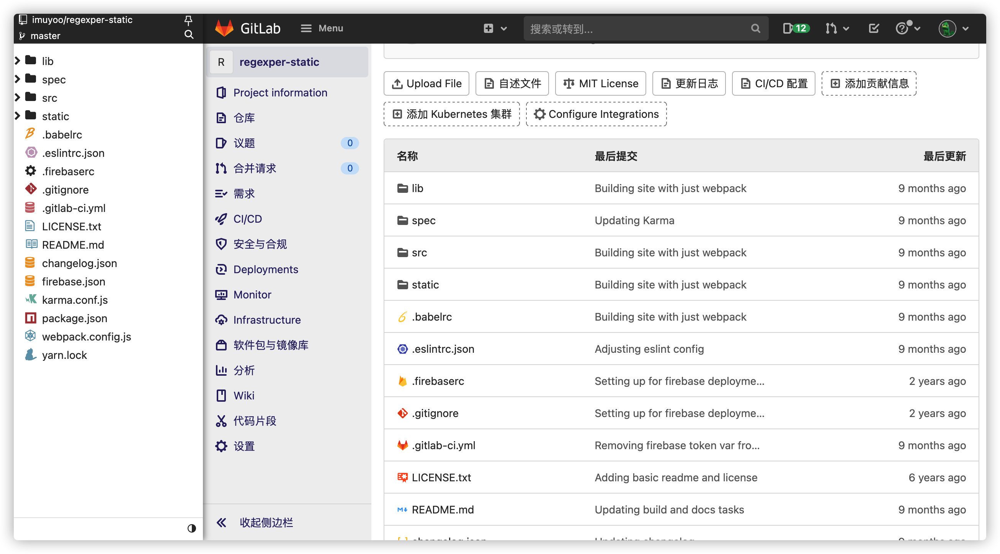
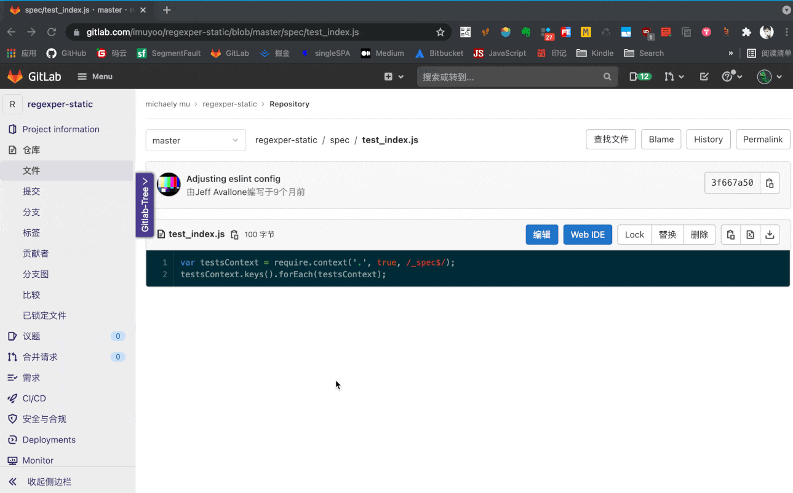

# Gitlab Tree



## 关于

<!-- - [Chrome Extension]()  -->



## 开发设置

1. 克隆仓库到本地

2. 安装依赖包

   ```bash
   $ npm install
   ```

3. 启动

   ```
   $ npm start
   ```


## 感谢

其中本插件使用了以下开源包:

- [react](https://github.com/facebook/react)
- [redux](https://github.com/reduxjs/redux)
- [webext-redux](https://github.com/tshaddix/webext-redux)
- [file-icons](https://github.com/file-icons/atom)
- [dark-gitlab](https://gitlab.com/vednoc/dark-gitlab)
- [axios](https://github.com/axios/axios)
- [immer](https://github.com/immerjs/immer)
- [fzy.js](https://github.com/jhawthorn/fzy.js)
